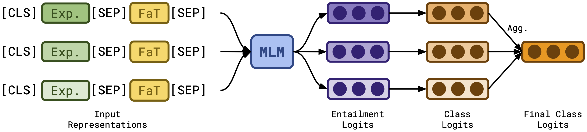

# ExEnt #

This repository contains the official code for models described in the paper: "[CLUES: A Benchmark for Learning Classifiers using Natural Language Explanations](https://arxiv.org/abs/2204.07142)".

[**CLUES**](https://clues-benchmark.github.io) is a benchmark of structured-data classification tasks paired with natural language explanations. In this repository, we provide code for **ExEnt** (**Ex**planation **Ent**ailment), a model capable of zero-shot generalization to novel tasks *purely* from language explanations.

## Model ## 

<p align="center">
 
</p>

## Setup ##

Setup environment by running `source bin/init.sh`. This will 

- Download the datasets from: https://clues-benchmark.github.io
- Install and setup environment with correct dependencies.

## Training  ##

To train the model, run the following commands:
```
bash bin/setup.sh
bash bin/train.sh {model_name} {benchmark_type}
```
Here, `{model_name}` is one of `'ExEnt', 'RobertaNoExp, 'RobertaExpConcat'`. `{benchmark_type}` refers to one of `'real'` or `'syn'` to train on CLUES-Real and CLUES-Syn respectively.

The output will be in the experiment directory `exp_out/{model_name}/{benchmark_type}/{timestamp}/`. Once the model has been trained, the following files can be found in the directory:
```
exp_out/{model_name}/{benchmark_type}/{timestamp}/
    |
    |__ best_model.pt
    |__ dev_scores.json
    |__ config.json
    |__ src
```
**Note**: The best model saved here is based on the averaged validation accuracy over the train tasks.

## Zero-Shot Evaluation ##

To evaluate the model on the test tasks, run the following command:
```
bash bin/setup.sh
bash bin/test.sh exp_out/{model_name}/{benchmark_type}/{timestamp}/
```
The test scores for each task will be written in a dictionary under `exp_out/{model_name}/{benchmark_type}/{timestamp}/test_scores.json`.

## Contact ##

For any doubts or questions regarding the work, please contact Rakesh ([rrmenon@cs.unc.edu](mailto:rrmenon+exent@cs.unc.edu)) or Sayan ([sayghosh@cs.unc.edu](mailto:sayghosh+exent@cs.unc.edu)). For any bug or issues with the code, feel free to open a GitHub issue or pull request.

## Citation ##
    @inproceedings{menon2022clues,
        Author = {Menon, Rakesh R. and Ghosh, Sayan and Srivastava, Shashank},
        Title = {{CLUES}: {A} {B}enchmark for {L}earning {C}lassifiers using {N}atural {L}anguage {E}xplanations},
        Year = 2022,
        Journal = {In Proceedings of the 60th Annual Meeting of the Association for Computational Linguistics (to appear)},
    }
